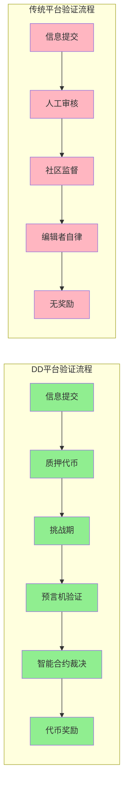
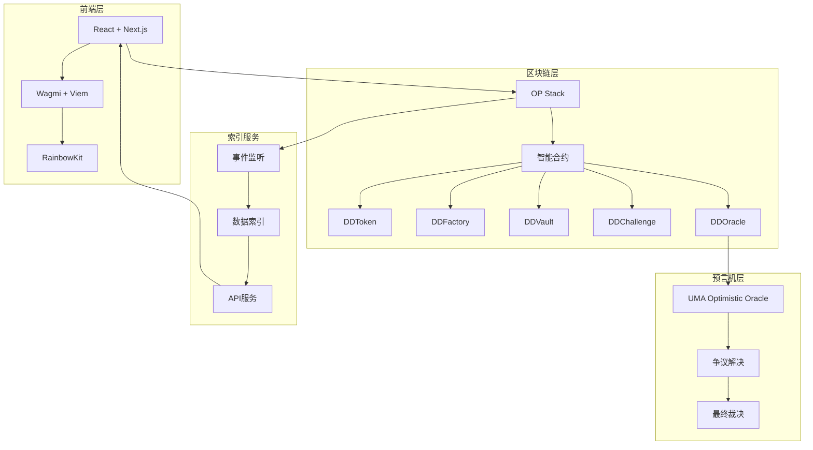
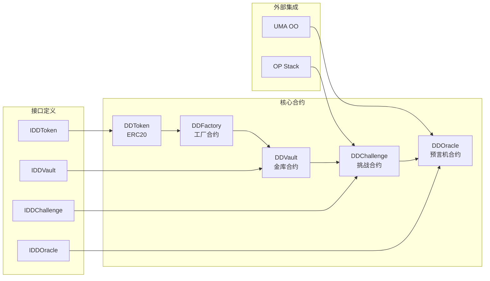
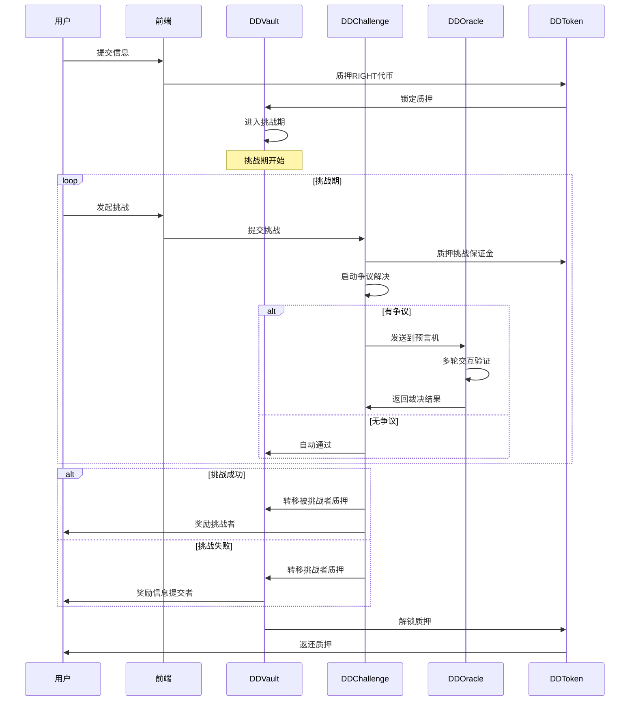
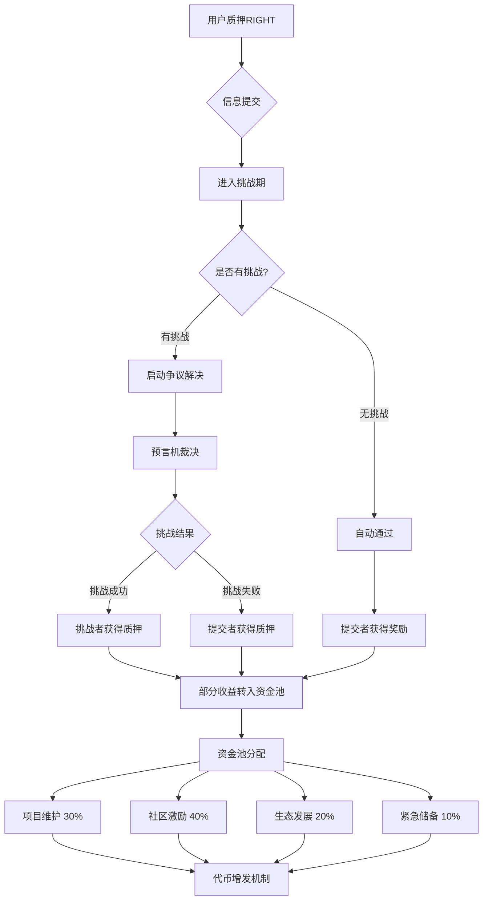
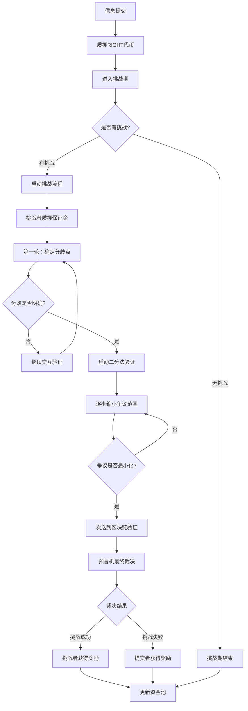
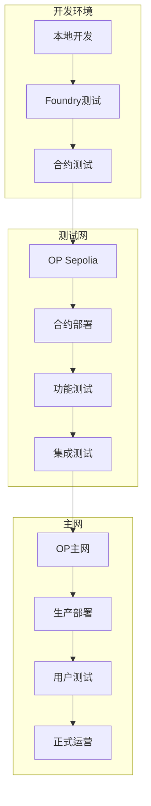
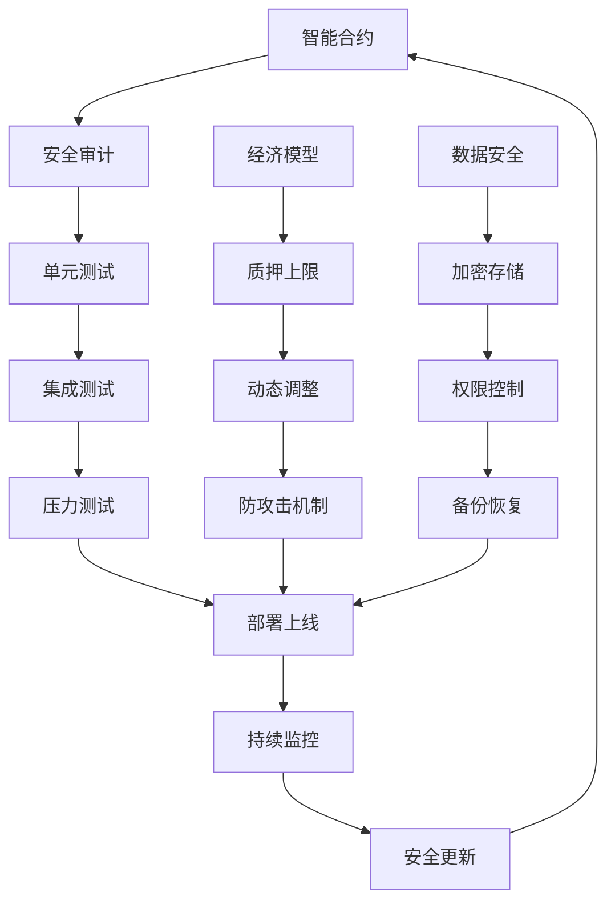
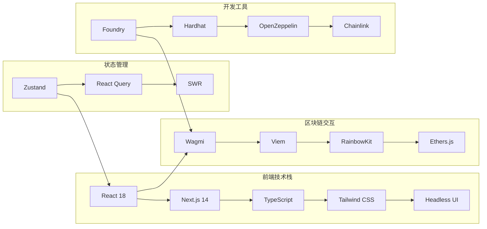

# DD项目技术架构图

## 1. 竞品对比分析

### 1.1 架构模式对比

```mermaid
graph TB
    subgraph "DD平台 - 去中心化架构"
        A1[用户] --> B1[智能合约]
        B1 --> C1[区块链网络]
        C1 --> D1[预言机验证]
        D1 --> E1[代币激励]
    end
    
    subgraph "GitHub - 中心化架构"
        A2[用户] --> B2[GitHub服务器]
        B2 --> C2[中心化数据库]
        C2 --> D2[人工审核]
        D2 --> E2[无激励]
    end
    
    subgraph "传统Wiki - 集中式架构"
        A3[用户] --> B3[Wiki服务器]
        B3 --> C3[集中式数据库]
        C3 --> D3[权限管理]
        D3 --> E3[无激励]
    end
    
    style A1 fill:#90EE90
    style B1 fill:#90EE90
    style C1 fill:#90EE90
    style D1 fill:#90EE90
    style E1 fill:#90EE90
    
    style A2 fill:#FFB6C1
    style B2 fill:#FFB6C1
    style C2 fill:#FFB6C1
    style D2 fill:#FFB6C1
    style E2 fill:#FFB6C1
    
    style A3 fill:#FFB6C1
    style B3 fill:#FFB6C1
    style C3 fill:#FFB6C1
    style D3 fill:#FFB6C1
    style E3 fill:#FFB6C1
```

### 1.2 数据验证流程对比

```mermaid
graph LR
    subgraph "DD平台验证流程"
        A1[信息提交] --> B1[质押代币]
        B1 --> C1[挑战期]
        C1 --> D1[预言机验证]
        D1 --> E1[智能合约裁决]
        E1 --> F1[代币奖励]
    end
    
    subgraph "传统平台验证流程"
        A2[信息提交] --> B2[人工审核]
        B2 --> C2[社区监督]
        C2 --> D2[编辑者自律]
        D2 --> E2[无奖励]
    end
    
    style A1 fill:#90EE90
    style B1 fill:#90EE90
    style C1 fill:#90EE90
    style D1 fill:#90EE90
    style E1 fill:#90EE90
    style F1 fill:#90EE90
    
    style A2 fill:#FFB6C1
    style B2 fill:#FFB6C1
    style C2 fill:#FFB6C1
    style D2 fill:#FFB6C1
    style E2 fill:#FFB6C1
```

## 3. 系统整体架构

```mermaid
graph TB
    subgraph "前端层"
        A[React + Next.js] --> B[Wagmi + Viem]
        B --> C[RainbowKit]
    end
    
    subgraph "区块链层"
        D[OP Stack] --> E[智能合约]
        E --> F[DDToken]
        E --> G[DDFactory]
        E --> H[DDVault]
        E --> I[DDChallenge]
        E --> J[DDOracle]
    end
    
    subgraph "预言机层"
        K[UMA Optimistic Oracle] --> L[争议解决]
        L --> M[最终裁决]
    end
    
    subgraph "索引服务"
        N[事件监听] --> O[数据索引]
        O --> P[API服务]
    end
    
    A --> D
    J --> K
    D --> N
    P --> A
```

## 4. 智能合约架构

```mermaid
graph LR
    subgraph "核心合约"
        A[DDToken<br/>ERC20] --> B[DDFactory<br/>工厂合约]
        B --> C[DDVault<br/>金库合约]
        C --> D[DDChallenge<br/>挑战合约]
        D --> E[DDOracle<br/>预言机合约]
    end
    
    subgraph "接口定义"
        F[IDDToken] --> A
        G[IDDVault] --> C
        H[IDDChallenge] --> D
        I[IDDOracle] --> E
    end
    
    subgraph "外部集成"
        J[UMA OO] --> E
        K[OP Stack] --> D
    end
```

## 5. 用户交互流程

```mermaid
sequenceDiagram
    participant U as 用户
    participant F as 前端
    participant V as DDVault
    participant C as DDChallenge
    participant O as DDOracle
    participant T as DDToken
    
    U->>F: 提交信息
    F->>T: 质押RIGHT代币
    T->>V: 锁定质押
    V->>V: 进入挑战期
    
    Note over V: 挑战期开始
    
    loop 挑战期
        U->>F: 发起挑战
        F->>C: 提交挑战
        C->>T: 质押挑战保证金
        C->>C: 启动争议解决
        
        alt 有争议
            C->>O: 发送到预言机
            O->>O: 多轮交互验证
            O->>C: 返回裁决结果
        else 无争议
            C->>V: 自动通过
        end
    end
    
    alt 挑战成功
        C->>V: 转移被挑战者质押
        C->>U: 奖励挑战者
    else 挑战失败
        C->>V: 转移挑战者质押
        V->>U: 奖励信息提交者
    end
    
    V->>T: 解锁质押
    T->>U: 返还质押
```

## 4. 经济模型流程图

```mermaid
graph TD
    A[用户质押RIGHT] --> B{信息提交}
    B --> C[进入挑战期]
    C --> D{是否有挑战?}
    
    D -->|无挑战| E[自动通过]
    D -->|有挑战| F[启动争议解决]
    
    F --> G[预言机裁决]
    G --> H{挑战结果}
    
    H -->|挑战成功| I[挑战者获得质押]
    H -->|挑战失败| J[提交者获得质押]
    
    I --> K[部分收益转入资金池]
    J --> K
    
    E --> L[提交者获得奖励]
    L --> K
    
    K --> M[资金池分配]
    M --> N[项目维护 30%]
    M --> O[社区激励 40%]
    M --> P[生态发展 20%]
    M --> Q[紧急储备 10%]
    
    N --> R[代币增发机制]
    O --> R
    P --> R
    Q --> R
```

## 6. 挑战机制详细流程

```mermaid
graph TD
    A[信息提交] --> B[质押RIGHT代币]
    B --> C[进入挑战期]
    C --> D{是否有挑战?}
    
    D -->|无挑战| E[挑战期结束]
    D -->|有挑战| F[启动挑战流程]
    
    F --> G[挑战者质押保证金]
    G --> H[第一轮：确定分歧点]
    
    H --> I{分歧是否明确?}
    I -->|否| J[继续交互验证]
    I -->|是| K[启动二分法验证]
    
    J --> H
    K --> L[逐步缩小争议范围]
    
    L --> M{争议是否最小化?}
    M -->|否| L
    M -->|是| N[发送到区块链验证]
    
    N --> O[预言机最终裁决]
    O --> P{裁决结果}
    
    P -->|挑战成功| Q[挑战者获得奖励]
    P -->|挑战失败| R[提交者获得奖励]
    
    Q --> S[更新资金池]
    R --> S
    E --> S
```

## 7. 部署架构图

```mermaid
graph TB
    subgraph "开发环境"
        A[本地开发] --> B[Foundry测试]
        B --> C[合约测试]
    end
    
    subgraph "测试网"
        D[OP Sepolia] --> E[合约部署]
        E --> F[功能测试]
        F --> G[集成测试]
    end
    
    subgraph "主网"
        H[OP主网] --> I[生产部署]
        I --> J[用户测试]
        J --> K[正式运营]
    end
    
    C --> D
    G --> H
```

## 8. 安全架构图

```mermaid
graph TD
    A[智能合约] --> B[安全审计]
    B --> C[单元测试]
    C --> D[集成测试]
    D --> E[压力测试]
    
    F[经济模型] --> G[质押上限]
    G --> H[动态调整]
    H --> I[防攻击机制]
    
    J[数据安全] --> K[加密存储]
    K --> L[权限控制]
    L --> M[备份恢复]
    
    E --> N[部署上线]
    I --> N
    M --> N
    
    N --> O[持续监控]
    O --> P[安全更新]
    P --> A
```

## 9. 技术栈架构

```mermaid
graph LR
    subgraph "前端技术栈"
        A[React 18] --> B[Next.js 14]
        B --> C[TypeScript]
        C --> D[Tailwind CSS]
        D --> E[Headless UI]
    end
    
    subgraph "区块链交互"
        F[Wagmi] --> G[Viem]
        G --> H[RainbowKit]
        H --> I[Ethers.js]
    end
    
    subgraph "状态管理"
        J[Zustand] --> K[React Query]
        K --> L[SWR]
    end
    
    subgraph "开发工具"
        M[Foundry] --> N[Hardhat]
        N --> O[OpenZeppelin]
        O --> P[Chainlink]
    end
    
    A --> F
    J --> A
    M --> F
```
