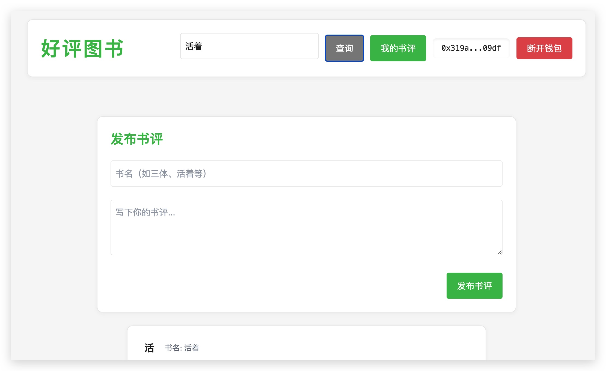

# Haoping Book Review App


A beginner-friendly decentralized book review application built for the Sepolia testnet. Perfect introduction to Web3 development with full blockchain integration.

## Features

- ✅ Add a book review to the blockchain (testnet)
- ✅ Query all reviews for a specific book
- ✅ Delete your own book reviews
- ✅ Upvote or downvote other users' book reviews
- 🔒 MetaMask wallet authentication
- 🌐 Sepolia testnet deployment ready
- 📱 Next.js frontend

## Tech Stack

**Core**  
Solidity · Next.js · Truffle · ethers v5 

**Infrastructure**  
Sepolia Testnet · Truffle · MetaMask  

## Quick Start

1. Clone repo and install dependencies:
```bash
https://github.com/JP3000/book-review-solidity.git
cd book-review-solidity
cd client 
npm install
```

2. Start the frond-end:
```bash
    yarn dev
```

3. Open the app in your browser:
```bash
http://localhost:3000
```

4. Connect your MetaMask wallet to the Sepolia testnet and deploy the smart contract.

## Deploying to Sepolia Testnet

1. Install Truffle:
```bash
    cd backend
    npm install -g truffle
```

2. Compile the smart contract:
```bash
    truffle dashboard
```
3. Deploy the smart contract to Sepolia testnet:
```bash
    truffle migrate --network
```
⚠️ be careful with the network name, it should be `sepolia`.

3. Deploy the smart contract to Sepolia testnet by truffle dashboard.

## Acknowledgments

Thanks to all the amazing tools and developers who contributed to this project.

- **Project Inspiration:** 
[Build a Todo App with Solidity, Next.js & Truffle](https://www.youtube.com/watch?v=awQTDVvYyjI) by Clever Programmer
