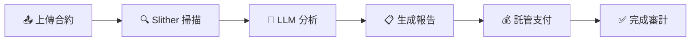

# 🔍 Smart AuDit 

<div align="center">

**🚀 一鍵智慧合約安全審計與託管支付平台 🚀**

*讓 Web3 安全審計變得簡單、智能、可信*

[](https://opensource.org/licenses/MIT)
[](https://www.python.org/downloads/)
[](https://nodejs.org/)

</div>

---

## 💡 專案簡介

想像一下：**只需上傳合約，就能獲得專業級的安全報告！** 🎯

Smart AuDit 結合了最先進的靜態分析工具與 AI 智能，打造出一個端到端的智慧合約審計平台。不再需要手動解讀複雜的掃描結果，不再擔心審計費用的支付糾紛 —— 一切都自動化、智能化、去中心化！

**✨ 從上傳到報告，只需 3 步驟：**
```
📤 上傳合約 → 🔍 AI 智能掃描 → 📊 獲得專業報告
```

## 🌟 核心功能

### 🤖 智能審計引擎
- **全自動化流程**：上傳 → 掃描 → 分析 → 報告，零人工干預！
- **AI 驅動報告**：不只是冰冷的掃描結果，而是有溫度的專業建議 ✨
- **多層次分析**：Slither 靜態分析 + LLM 語意理解 = 更準確的風險識別

### 💰 智能託管系統  
- **去中心化支付**：`AuditEscrow` 智慧合約自動管理資金流 🔐
- **零信任機制**：無需第三方，代碼即合約，透明且可信
- **爭議仲裁**：內建仲裁機制，保障雙方權益

### 📊 完整生態系統
- **事件追蹤**：所有鏈上行為都有跡可循 🔍  
- **API 優先**：RESTful API + React dApp，開發者友好
- **報告歸檔**：所有審計記錄永久保存，便於追溯和比對

## 🚀 為什麼選擇 Smart AuDit？

| 特色 | 傳統方式 😰 | Smart AuDit 😎 |
|------|------------|----------------|
| **審計流程** | 手動操作，耗時費力 | 一鍵自動化，秒級完成 |
| **報告品質** | 技術術語，難以理解 | AI 轉譯，清晰易懂 |
| **支付安全** | 人工協調，容易糾紛 | 智慧合約，自動託管 |
| **數據安全** | 依賴第三方服務 | 可本地部署，數據自主 |
| **可擴展性** | 固定流程，難以調整 | 模組化設計，隨意客製 |

## 🎯 適用場景

### 🏢 安全團隊
> "我們需要批量掃描大量合約，快速識別高風險項目"
- ✅ 高效批量處理
- ✅ 標準化報告輸出  
- ✅ 歷史記錄追蹤

### 🚀 Web3 創業團隊
> "在開發過程中持續監控合約安全性"
- ✅ CI/CD 集成友好
- ✅ 低成本快速驗證
- ✅ 開發者友好的 API

### 🤝 審計服務商
> "需要透明、可信的費用結算機制"
- ✅ 去中心化託管支付
- ✅ 自動化爭議處理
- ✅ 完整的審計追蹤

---

## ⚡ 快速上手

### 📋 環境準備

確保你的開發環境具備以下條件：

- 🟢 **Node.js 18+** & **npm 9+** 
- 🐍 **Python 3.10+**
- ⚒️ **Foundry** (可選，用於合約編譯/部署)
- 🔗 **本地節點** (可選，Anvil/Hardhat)

### 🔧 Step 1: 環境配置

**後端設定**
```bash
# 複製範例檔案
cp backend/.env.example backend/.env
```

**前端設定** 
```bash
# 複製範例檔案  
cp frontend/.env.example frontend/.env
```

<details>
<summary>📝 重要環境變數說明</summary>

**後端 (backend/.env)**
- `RPC`: 區塊鏈節點 RPC（預設 `http://localhost:8545`）
- `CHAIN_ID`: 鏈 ID，如 `11155111`(Sepolia)、`31337`(Anvil)
- `CONTRACT_ADDRESS`: 審計託管合約地址 
- `SERVICE_PK`: 後端服務私鑰 ⚠️ **請勿外流**
- `OPENAI_API_KEY`: OpenAI API 金鑰
- `LLM_MODEL`: LLM 模型名稱（預設 `gpt-4o-mini`）

**前端 (frontend/.env)**
- `VITE_API_URL`: 後端 API URL（預設 `http://localhost:8000`）
- `VITE_CONTRACT`: 合約地址（需與後端一致）

</details>

### 🐍 Step 2: 啟動後端
```bash
cd backend
pip install -r requirements.txt
uvicorn main:app --reload --port 8000
```
🎉 **後端啟動完成！** API 將在 `http://localhost:8000` 提供服務

### ⚛️ Step 3: 啟動前端  
```bash
cd frontend
npm install
npm run dev
```
🎉 **前端啟動完成！** 應用將在 `http://localhost:5173` 開啟

### 🔗 Step 4: 部署合約 (可選)

如果你想使用本地測試鏈：

**啟動本地節點**
```bash
anvil
```

**部署合約**
```bash
cd contracts
forge build
forge script script/Deploy.s.sol --broadcast --rpc-url http://localhost:8545
```

記得將合約地址更新到環境變數中！ 📝

---

## 📁 專案結構

```
Smart AuDit/
├── 🏗️ backend/          # FastAPI 後端 + 審計引擎
├── 🌐 frontend/         # React dApp 前端介面  
├── 📜 contracts/        # AuditEscrow 智慧合約
├── 📊 reports/          # 審計報告輸出 (gitignore)
└── 🗂️ tmp/             # 臨時工作檔案 (gitignore)
```

## 🔄 工作流程



1. **📤 合約提交** → 使用者上傳智慧合約原始碼
2. **🔍 靜態分析** → Slither 工具執行深度安全掃描  
3. **🤖 AI 彙整** → LLM 將技術結果轉換為易懂報告
4. **💰 資金託管** → 透過 AuditEscrow 合約處理付款
5. **✅ 交付完成** → 報告交付，資金自動釋放

---

## 📄 授權協議

MIT License - 自由使用、修改、分發 🎉

---

<div align="center">

**🌟 如果這個專案對你有幫助，請給個 Star！🌟**

*讓 Web3 世界更安全，從 Smart AuDit 開始* 🚀

</div>

